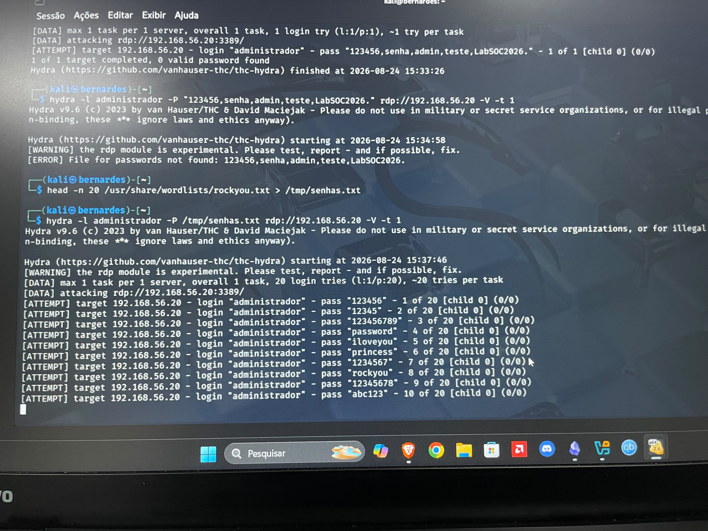
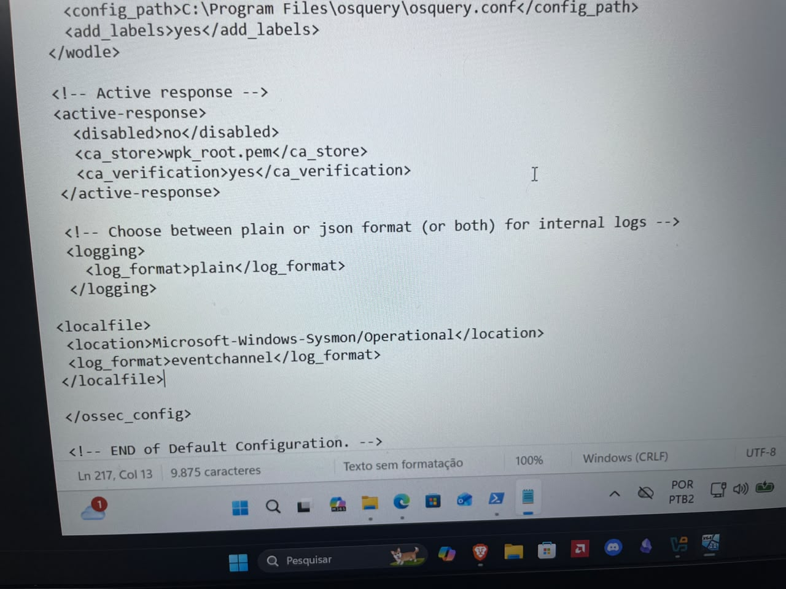
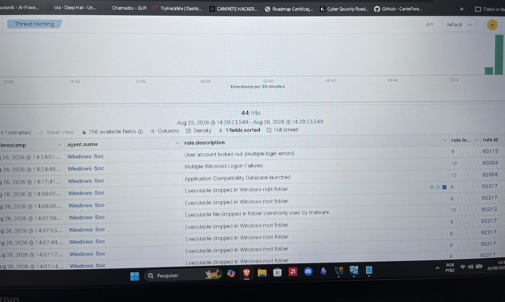

# 🛡️ Detection Engineering Lab: RDP Brute-Force Detection with Wazuh SIEM & Sysmon

## 🎯 Overview
This lab demonstrates end-to-end threat detection capabilities by simulating an RDP Brute-Force attack against a Windows endpoint and collecting enriched telemetry via Sysmon into a central Wazuh SIEM.

---

## ⚔️ Attack Simulation & MITRE ATT&CK Mapping
- **Tactics:** Credential Access (TA0006)
- **Techniques:** Brute Force (T1110), Remote Services: RDP (T1021.001)
- **Tool Used:** `hydra`

---

## 🔍 Log Analysis & Detection Pipeline
1. **Endpoint Telemetry:** Windows Event ID `4625` (An account failed to log on) and Sysmon Event ID `3` (Network connection).
2. **Ingestion:** Configured `ossec.conf` on the agent to read `Microsoft-Windows-Sysmon/Operational`.
3. **Alert Triggered:** Wazuh SIEM generated alerts upon detecting multiple failed authentication attempts within a short timeframe.

---

## 📸 Screenshots & Evidence

### 1. Attack Execution (Hydra)

### 2. Agent Configuration (ossec.conf)

### 3. Wazuh SIEM Alert Dashboard

---

## 🚀 Key Takeaways & Future Enhancements
- Configured Sysmon to capture granular endpoint events.
- Learned how to troubleshoot agent connectivity and custom log forwarding via `ossec.conf`.
- **Next Step:** Implement **Wazuh Active Response** to automatically block attacking IPs on the Windows Host Firewall upon detection.
